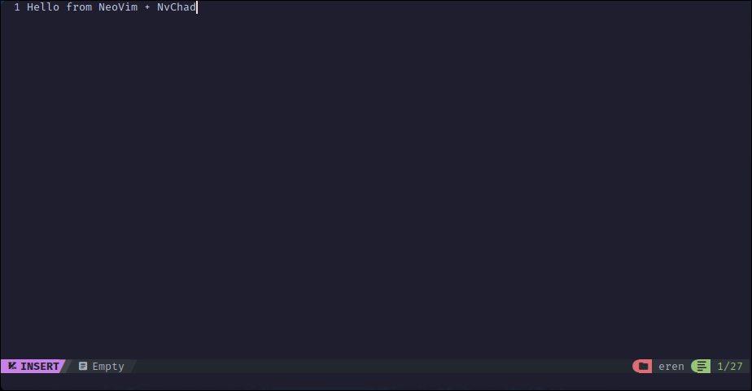

## Erffy Dots - [Nvim](https://github.com/neovim/neovim)
My nvim configuration files

### Installation Guide
```sh
bash -c "bash <(curl -sL https://raw.githubusercontent.com/erffy-dots/nvim/main/install.sh)"
```

### Screenshots

